  
# 🍽️ **DALEEL — Smart Restaurant Recommender**

Personalized restaurant recommendations powered by **Neural Collaborative Filtering (NCF)**, with optional **BERT** sentiment enrichment.
  

---

## 🧭 Abstract
**DALEEL** predicts user–restaurant preferences using **NCF** and explores fusing review **sentiment** (via **BERT**) to refine rankings. The repo ships a production-ready **FastAPI** backend (NCF) and a **Streamlit** demo. Target geography: Eastern Province (KSA).

---

## 🔎 Overview
- **Goal:** deliver relevant, personalized restaurant suggestions.
- **Core model:** **NCF** trained on user–item interactions (ratings).
- **Hybrid :** combine NCF predictions with
- **BERT-based** sentiment of reviews to promote consistently well-reviewed places.
- **Interfaces**
  - **API (FastAPI):** online NCF recommendations with *category* and *city* filters; review submission endpoint.
  - **UI (Streamlit):** quick demo to fetch recommendations and post reviews.

---

## 🧪 Pipeline

```mermaid
flowchart LR
  A["Data Sources<br/>ratings + reviews + restaurants"] --> B["Preprocess & Clean<br/>NA/dupes, types"]
  B --> C["Encode IDs<br/>LabelEncoder user & item"]
  C --> D["Train NCF<br/>PyTorch; save state_dict"]
  D --> E["Evaluate<br/>MSE / RMSE / Accuracy"]
  E --> F["Serve via FastAPI<br/>/recommend, /review"]
  C --> G["BERT Sentiment<br/>DistilBERT SST-2"]
  G --> H["Hybrid Scoring<br/>0.7× NCF + 0.3× Sentiment"]


```

**Steps**
1) Ingest multi-source CSVs.  
2) Clean, deduplicate, type-cast.  
3) Fit & persist `LabelEncoder`s for **users** and **restaurants**.  
4) Train **NCF** and save weights (`ncf_weights.pth`).  
5) Evaluate and report metrics.  
6) Serve **NCF** via **FastAPI**; ratings scaled to **[1,5]** with `1 + 4*sigmoid(raw)`.  
7) *(Research)* Compute **BERT** sentiment offline and blend with NCF for a hybrid score.

---

## 📦 Data
The dataset was assembled from **multiple sources** and **partly generated** for prototyping:

- **User reviews:** `data/user_review_finalversion.csv`  
  https://github.com/AnfalAlkuraydis/DALEEL/blob/main/data/user_review_finalversion.csv

- **User ratings:** `data/user_rating_finalversion.csv`  
  https://github.com/AnfalAlkuraydis/DALEEL/blob/main/data/user_rating_finalversion.csv

- **Restaurants catalog:** `data/Restaurants_finalversion.csv`  
  https://github.com/AnfalAlkuraydis/DALEEL/blob/main/data/Restaurants_finalversion.csv

**Scale:** more than **1,000 restaurants**.  
**Supported cities:** **Dammam**, **Dhahran**, **Jubail**, **Khobar**.

---

## 📈 Results
| Metric | Value |
|---|---:|
| **Test MSE** | `0.0071` |
| **Test RMSE** | `0.0842` |
| **Test Accuracy** | `99.57%` |

---

## 🎬 Demo

  
  

  

---

## 🔀 Two Paths in the Codebase
1) **NCF + BERT (offline / hard-coded hybrid)**  
   - Uses a pre-trained **DistilBERT** sentiment classifier (SST‑2) on reviews.  
   - Aggregates per-restaurant sentiment (mean of {NEG=0, POS=1}).  
   - Blends with NCF: $\text{HybridScore} = 0.7 \times \text{NCF} + 0.3 \times \text{Sentiment}$

   - **Why BERT?** It captures nuance from natural-language reviews (tone, polarity, context) that raw ratings may miss.

2) **NCF-only API (production path)**  
   - FastAPI serves top‑K items ranked by **NCF** (scaled to **[1,5]**).  
   - Filters: **category** + **city**.  
   - `/review` endpoint appends new reviews for future analysis.

> **Future Work:** integrate BERT sentiment directly into the API request path (with batching/caching) to serve **hybrid** scores live.

---

Made with ❤️ 

